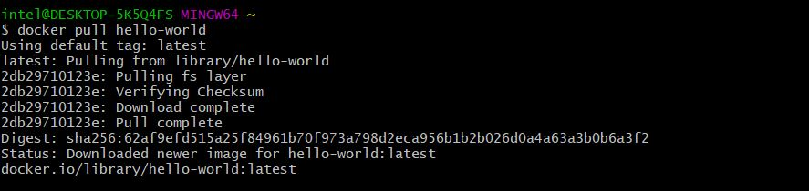

# Docker-Assignment2

## Hello World Docker Image, Run Hello World Docker Image Locally. 

1) docker pull hello-world 

 

2) docker run hello-world 

 

###############################################################################################################################################################
